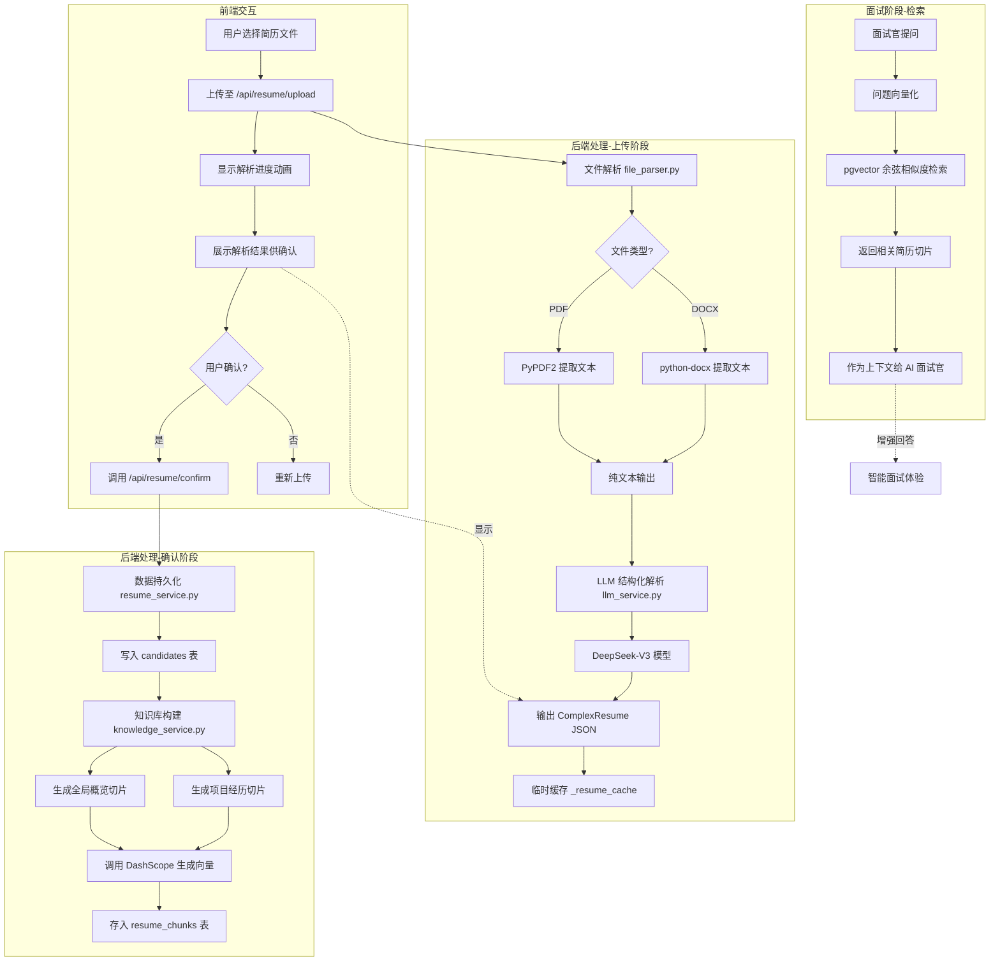
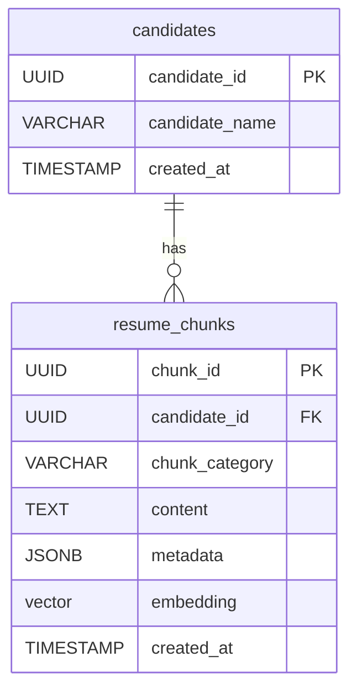

# 简历知识库构建流程技术文档

## 1. 概述

这是一个**AI 驱动的简历解析与知识库构建系统**，它能将用户上传的 PDF/Word 简历自动解析为结构化数据，并将关键信息转化为向量存储到数据库中，供后续面试时进行智能检索和上下文增强。

**一句话总结**：用户上传简历 → 系统解析成结构化数据 → 向量化存入 pgvector → 面试时智能检索相关信息。

---

## 2. 完整流程图



---

## 3. 第一步：前端上传交互

### 3.1 用户操作页面

用户在 `ResumeUpload.tsx` 页面进行操作，该页面位于路由 `/resume-upload`。

### 3.2 支持的文件格式与限制

```typescript
// 支持的 MIME 类型
const validTypes = ['application/pdf', 'application/vnd.openxmlformats-officedocument.wordprocessingml.document'];

// 大小限制
if (file.size > 10 * 1024 * 1024) {  // 10MB
  setError('文件大小不能超过 10MB');
  return;
}
```

- **支持格式**：PDF、DOCX（Word 2007+）
- **大小限制**：最大 10MB
- **交互方式**：拖拽上传 或 点击选择文件

### 3.3 三个阶段的交互流程

页面通过 `stage` 状态变量控制三个阶段：

```typescript
type Stage = 'upload' | 'parsing' | 'confirm';
```

| 阶段 | 用户看到什么 | 系统做了什么 |
|------|-------------|-------------|
| **upload** | 拖拽上传区域、已选文件预览、开始解析按钮 | 等待用户选择文件并点击上传 |
| **parsing** | 加载动画、进度条、动态提示文字（"正在解析简历..."） | 调用后端 API，等待解析完成 |
| **confirm** | 候选人姓名、技能标签、行为标签、项目经历列表 | 展示解析结果，等待用户确认 |

### 3.4 调用的 API

**上传解析接口**：
```typescript
const response = await fetch('/api/resume/upload', {
  method: 'POST',
  body: formData,  // FormData 包含 file 字段
});
```

**确认接口**：
```typescript
const response = await fetch('/api/resume/confirm', {
  method: 'POST',
  headers: { 'Content-Type': 'application/json' },
  body: JSON.stringify({ 
    candidate_id: candidateId, 
    resume: resumeData.resume  // ComplexResume 的 JSON 对象
  }),
});
```

---

## 4. 第二步：文件解析（PDF/Word → 纯文本）

### 4.1 为什么需要这一步？

简历文件（PDF/Word）本质上是排版格式文件，计算机无法直接理解其中的内容结构。我们需要将二进制文件转换为纯文本，才能交给 LLM 进行结构化解析。

### 4.2 使用的库

| 库 | 用途 | 安装方式 |
|---|------|---------|
| **PyPDF2** | 解析 PDF 文件，提取每页文本 | `pip install PyPDF2` |
| **python-docx** | 解析 Word 文档，提取段落文本 | `pip install python-docx` |

### 4.3 具体提取逻辑

**PDF 解析**：
```python
async def extract_text_from_pdf(file: UploadFile) -> str:
    content = await file.read()
    pdf_file = io.BytesIO(content)
    pdf_reader = PyPDF2.PdfReader(pdf_file)
    
    text_parts = []
    for page in pdf_reader.pages:
        page_text = page.extract_text()
        if page_text:
            text_parts.append(page_text)
    
    return "\n".join(text_parts)
```

核心思路：
1. 将上传的二进制数据转为内存文件流（`BytesIO`）
2. 使用 `PdfReader` 读取 PDF
3. 遍历每一页，调用 `extract_text()` 提取文本
4. 用换行符拼接所有页面的文本

**Word 解析**：
```python
async def extract_text_from_docx(file: UploadFile) -> str:
    content = await file.read()
    doc_file = io.BytesIO(content)
    doc = Document(doc_file)
    
    text_parts = []
    for paragraph in doc.paragraphs:
        if paragraph.text.strip():
            text_parts.append(paragraph.text)
    
    return "\n".join(text_parts)
```

核心思路：
1. 使用 `Document` 类加载 Word 文件
2. 遍历所有段落（`doc.paragraphs`）
3. 过滤空段落，提取有效文本

### 4.4 异常处理

```python
try:
    # 解析逻辑...
except Exception as e:
    raise HTTPException(
        status_code=400, 
        detail=f"PDF 文件解析失败，文件可能已损坏: {str(e)}"
    )
```

常见异常情况：
- 文件已损坏或加密
- 文件格式与扩展名不匹配
- 文件内容为空（提取后检查）

---

## 5. 第三步：LLM 结构化解析（纯文本 → ComplexResume）

### 5.1 为什么用 LLM 而不是正则/规则？

| 对比维度 | 正则/规则 | LLM |
|---------|----------|-----|
| **适应性** | 需要针对每种简历模板编写规则 | 自动适应各种格式 |
| **语义理解** | 只能匹配固定模式 | 理解上下文语义 |
| **维护成本** | 每增加一种格式就要加规则 | 无需维护规则 |
| **准确性** | 对非标准格式容易出错 | 泛化能力强 |

简单说：**简历格式千奇百怪，用规则写不完，让 AI 自动理解更靠谱。**

### 5.2 使用的模型与调用方式

```python
# 配置信息（来自 .env）
DEEPSEEK_API_KEY = os.getenv("DEEPSEEK_API_KEY")
DEEPSEEK_BASE_URL = os.getenv("DEEPSEEK_BASE_URL", "https://api.deepseek.com/v1")
DEEPSEEK_MODEL = os.getenv("DEEPSEEK_MODEL1", "deepseek-v3")

# 使用 OpenAI 兼容接口初始化客户端
client = AsyncOpenAI(
    api_key=DEEPSEEK_API_KEY,
    base_url=DEEPSEEK_BASE_URL
)
```

- **模型**：DeepSeek-V3（国产大模型，性价比高，JSON 输出稳定）
- **调用方式**：通过 OpenAI 兼容 API 调用，方便切换模型
- **异步调用**：使用 `AsyncOpenAI` 提高并发性能

### 5.3 Prompt 设计思路

```python
SYSTEM_PROMPT = """
你是一个专业的 HR 数据解析引擎。请提取用户简历，并严格输出合法的 JSON 格式。
【提取准则】
1. 技能解耦：必须区分"全局技能"和"单个项目专属技能(project_specific_skills)"。
2. STAR法则：项目经历必须尝试提取 situation_task 和 action_result。
3. 如果无数据请填空字符串 ""，绝不捏造。
输出必须符合以下 JSON 根节点：{"candidate_name": "", "global_profile": {}, "projects": []}
"""
```

关键设计要点：

1. **角色定位**："专业的 HR 数据解析引擎" —— 让 AI 进入专业角色
2. **格式约束**：要求"严格输出合法的 JSON 格式"，配合 `response_format={"type": "json_object"}` 确保输出有效 JSON
3. **技能解耦**：要求区分全局技能和项目专属技能，这是后续精准检索的关键
4. **STAR 法则**：要求提取项目背景和结果，便于面试时针对性提问
5. **防幻觉**："如果无数据请填空字符串，绝不捏造"，避免 AI 编造信息

### 5.4 ComplexResume 数据结构详解

```python
class StarExtraction(BaseModel):
    situation_task: str = Field(description="背景与任务难点")
    action_result: str = Field(description="具体行动与最终结果")

class GlobalProfile(BaseModel):
    summary: str = Field(description="5年后端开发经验...")
    all_technical_skills: List[str] = Field(description="全局技术栈汇总")
    all_behavioral_tags: List[str] = Field(description="全局软素质标签汇总")

class ProjectExperience(BaseModel):
    project_id: str
    project_name: str
    role: str
    time_period: str
    description: str
    project_specific_skills: List[str] = Field(description="仅在此项目中使用的技术")
    project_specific_behavioral: List[str] = Field(description="仅在此项目中体现的软素质")
    star_extraction: Optional[StarExtraction] = None

class ComplexResume(BaseModel):
    candidate_name: str
    global_profile: GlobalProfile
    projects: List[ProjectExperience]
```

**结构说明**：

| 字段 | 含义 | 设计理由 |
|------|------|---------|
| `candidate_name` | 候选人姓名 | 标识候选人，存储到 candidates 表 |
| `global_profile.summary` | 全局概览（如"5年Java开发经验"） | 快速了解候选人背景 |
| `global_profile.all_technical_skills` | 所有技术技能汇总 | 全局技能检索，如"这个候选人会 Spring 吗？" |
| `global_profile.all_behavioral_tags` | 软素质标签汇总 | 如"团队协作"、"沟通能力" |
| `projects[].project_specific_skills` | 项目专属技能 | **精准检索核心**：问某个项目的技术栈时只检索相关切片 |
| `star_extraction` | STAR 法则提取 | 面试官可针对背景/行动追问 |

### 5.5 STAR 法则提取的意义

STAR 是行为面试的经典框架：
- **S (Situation)**：背景是什么？
- **T (Task)**：任务是什么？
- **A (Action)**：采取了什么行动？
- **R (Result)**：结果如何？

通过 LLM 自动提取，面试系统可以：
1. 针对项目背景设计开场白："听说你在 XX 项目中负责..."
2. 追问具体行动："你是怎么解决这个技术难题的？"
3. 验证结果："最终性能提升了多少？"

### 5.6 技能双层结构的设计理由

**问题**：如果把所有技能都放在一个列表里，检索时会出现"噪音"。

**例子**：
- 简历显示候选人在项目 A 用了 Redis，项目 B 没用
- 面试官问项目 B 的缓存方案
- 如果只有全局技能列表，检索会返回 Redis 相关内容（实际与项目 B 无关）

**解决方案**：
```
全局技能：[Java, Spring, MySQL, Redis, Kafka, Docker]
项目 A 技能：[Redis, Kafka]  ← 只在这个项目用
项目 B 技能：[MySQL]          ← 只在这个项目用
```

这样检索时可以：
1. 按 `project_specific_skills` 精准匹配
2. metadata 中存储技能列表，支持 SQL 过滤

---

## 6. 第四步：用户确认

### 6.1 为什么需要确认步骤？

1. **AI 可能解析错误**：LLM 有一定概率误解简历内容，人工确认可纠错
2. **提升用户信任**：让用户看到系统提取的信息，增加透明度
3. **允许用户修改**：确认页面可以扩展为编辑页面（当前版本为只读确认）

### 6.2 前端展示的信息

```tsx
// 候选人姓名
<Text variant="h2" className="text-white">{resume.candidate_name}</Text>

// 技术技能标签
{resume.global_profile.all_technical_skills.map((skill) => (
  <span className="px-4 py-2 bg-neon-green/10 border border-neon-green/30 text-neon-green">
    {skill}
  </span>
))}

// 行为标签
{resume.global_profile.all_behavioral_tags.map((tag) => (
  <span className="px-4 py-2 bg-white/5 border border-gray-600 text-gray-300">
    {tag}
  </span>
))}

// 项目经历
{resume.projects.map((project) => (
  <div>
    <Text variant="h4">{project.name}</Text>
    <Text variant="caption">{project.time}</Text>
    <Text variant="caption">{project.role}</Text>
    <Text variant="p">{project.description}</Text>
  </div>
))}
```

### 6.3 临时缓存机制

```python
# resume_service.py
_resume_cache: dict[str, dict] = {}

async def upload_and_parse(file: UploadFile) -> dict:
    # ...解析逻辑...
    candidate_id = str(uuid.uuid4())
    _resume_cache[candidate_id] = resume.model_dump()  # 缓存
    return {"candidate_id": candidate_id, "resume": resume.model_dump()}

async def confirm_and_store(candidate_id: str, resume_data: dict):
    # ...存储逻辑...
    if candidate_id in _resume_cache:
        del _resume_cache[candidate_id]  # 清除缓存
```

**缓存设计理由**：
- 上传阶段只做解析，不落库（用户可能取消）
- 用内存缓存临时存储解析结果
- 确认后才真正持久化，避免垃圾数据

**注意**：当前缓存是进程内存，重启会丢失。生产环境建议用 Redis。

---

## 7. 第五步：数据持久化（candidates 表）

### 7.1 表结构说明

```sql
CREATE TABLE IF NOT EXISTS candidates (
    candidate_id UUID PRIMARY KEY,
    candidate_name VARCHAR(100) NOT NULL,
    created_at TIMESTAMP WITH TIME ZONE DEFAULT CURRENT_TIMESTAMP
);
```

| 字段 | 类型 | 说明 |
|------|------|------|
| `candidate_id` | UUID | 候选人唯一标识，主键 |
| `candidate_name` | VARCHAR(100) | 候选人姓名 |
| `created_at` | TIMESTAMP | 创建时间，自动填充 |

### 7.2 为什么用 UUID 作为主键？

1. **分布式友好**：不需要数据库自增，应用层生成，适合分布式系统
2. **安全性**：不暴露数据量（自增 ID 可推算出用户数）
3. **外键关联**：`resume_chunks` 表通过 `candidate_id` 关联

### 7.3 插入逻辑

```python
async def confirm_and_store(candidate_id: str, resume_data: dict):
    resume = ComplexResume(**resume_data)  # Pydantic 验证
    
    insert_sql = """
        INSERT INTO candidates (candidate_id, candidate_name)
        VALUES (:candidate_id, :candidate_name)
    """
    db.execute(insert_sql, {
        "candidate_id": candidate_id,
        "candidate_name": resume.candidate_name
    })
```

---

## 8. 第六步：向量化 + 知识库构建

### 8.1 为什么要做向量化？

**传统关键词搜索的问题**：
- 搜索"缓存经验"，如果简历写的是"Redis 实现"，匹配不到
- 无法理解语义相似性

**向量化的优势**：
- 将文本转为高维向量，语义相近的文本向量也相近
- 可以进行"语义检索"，而非死板的关键词匹配

### 8.2 使用的嵌入模型

```python
# 配置（来自 .env）
EMBEDDING_API_KEY = os.getenv("DASHSCOPE_API_KEY")
EMBEDDING_MODEL = os.getenv("EMBEDDING_MODEL", "text-embedding-v3")
EMBEDDING_BASE_URL = os.getenv("EMBEDDING_BASE_URL", "https://dashscope.aliyuncs.com/compatible-mode/v1")

# 初始化客户端
vector_client = AsyncOpenAI(
    api_key=EMBEDDING_API_KEY,
    base_url=EMBEDDING_BASE_URL
)

# 生成向量
async def generate_embedding(text: str) -> list[float]:
    response = await vector_client.embeddings.create(
        input=text,
        model=EMBEDDING_MODEL
    )
    return response.data[0].embedding
```

- **模型**：阿里云 DashScope `text-embedding-v3`
- **维度**：1024 维
- **特点**：中文效果好，价格便宜，兼容 OpenAI 接口

### 8.3 切片策略

**设计理念**：简历信息有层级结构，切片时保持语义完整性。

```python
async def build_candidate_knowledge_base(candidate_id: str, resume: ComplexResume):
    # 1. 全局概览切片
    global_text = f"[{name}的全局概览]：{resume.global_profile.summary}。技术栈：{', '.join(resume.global_profile.all_technical_skills)}。"
    global_meta = {
        "chunk_type": "global_summary",
        "skills": resume.global_profile.all_technical_skills
    }
    await _insert_chunk(candidate_id, global_text, global_meta)
    
    # 2. 项目经历切片（循环每个项目）
    for proj in resume.projects:
        proj_text = f"[{name}的项目经历] 在{proj.time_period}担任【{proj.project_name}】的{proj.role}。描述：{proj.description}。"
        if proj.star_extraction:
            proj_text += f" 背景任务：{proj.star_extraction.situation_task}。行动结果：{proj.star_extraction.action_result}。"
        
        proj_meta = {
            "chunk_type": "project_detail",
            "project_name": proj.project_name,
            "skills": proj.project_specific_skills
        }
        await _insert_chunk(candidate_id, proj_text, proj_meta)
```

**切片类型说明**：

| 切片类型 | 内容 | 用途 |
|---------|------|------|
| `global_summary` | 概览 + 全局技能 | 回答"这个候选人会什么？" |
| `project_detail` | 项目详情 + STAR + 项目技能 | 回答"这个项目做了什么？" |

### 8.4 每个切片的 metadata 结构

```json
// 全局切片
{
  "chunk_type": "global_summary",
  "skills": ["Java", "Spring", "Redis", "MySQL"]
}

// 项目切片
{
  "chunk_type": "project_detail",
  "project_name": "电商系统重构",
  "skills": ["Redis", "Kafka"]
}
```

metadata 的作用：
- 存储在 JSONB 字段中，支持 SQL 查询
- 可以按 `project_name` 或 `skills` 过滤切片
- GIN 索引加速 JSONB 查询

### 8.5 向量存储工作原理

**pgvector 是什么**：PostgreSQL 扩展，支持向量存储和相似度检索。

```sql
-- 创建向量列（1024维）
embedding vector(1024)

-- 创建 HNSW 索引
CREATE INDEX idx_resume_chunks_embedding 
ON resume_chunks USING hnsw (embedding vector_cosine_ops);
```

**存储流程**：
```python
async def _insert_chunk(candidate_id: str, content: str, metadata: dict):
    # 1. 文本 → 向量
    vector = await generate_embedding(content)
    
    # 2. 入库
    sql = """
        INSERT INTO resume_chunks (chunk_id, candidate_id, chunk_category, content, metadata, embedding)
        VALUES (:id, :cid, :cat, :cnt, :meta, :emb)
    """
    db.execute(sql, {
        "id": str(uuid.uuid4()),
        "cid": candidate_id,
        "cat": metadata.get("chunk_type"),
        "cnt": content,
        "meta": json.dumps(metadata, ensure_ascii=False),
        "emb": str(vector)  # 向量转字符串
    })
```

---

## 9. 第七步：向量检索（面试时使用）

### 9.1 面试过程中如何利用知识库

```mermaid
flowchart LR
    A[面试官提问<br/>"谈谈你的缓存经验"] --> B[问题向量化]
    B --> C[pgvector 检索<br/>余弦相似度排序]
    C --> D[返回相关切片]
    D --> E[作为上下文注入 Prompt]
    E --> F[AI 面试官生成回答]
```

### 9.2 余弦相似度检索原理

```python
async def search_resume_chunks(candidate_id: str, query_text: str, top_k: int = 3):
    # 1. 问题 → 向量
    response = await client.embeddings.create(input=query_text, model=EMBEDDING_MODEL)
    query_vector = response.data[0].embedding
    
    # 2. SQL 检索
    sql = """
        SELECT chunk_category, content, metadata 
        FROM resume_chunks 
        WHERE candidate_id = :candidate_id
        ORDER BY embedding <-> :query_vector::vector
        LIMIT :top_k
    """
```

**`<->` 运算符**：pgvector 的余弦距离运算符
- 距离越小，相似度越高
- `ORDER BY embedding <-> query_vector` = 按相似度降序排列

**数学原理**：
```
余弦相似度 = cos(θ) = (A · B) / (|A| × |B|)
余弦距离 = 1 - 余弦相似度
```

### 9.3 top_k 参数的意义

```python
results = db.fetchall(sql, {
    "candidate_id": candidate_id,
    "query_vector": str(query_vector),
    "top_k": 3  # 返回最相关的 3 个切片
})
```

- `top_k = 3`：只返回最相关的 3 个切片
- 原因：切片太多会超出 LLM 上下文限制，太少信息不足
- 可根据实际效果调整

### 9.4 HNSW 索引的作用

HNSW（Hierarchical Navigable Small World）是一种**近似最近邻搜索算法**：

```sql
CREATE INDEX idx_resume_chunks_embedding 
ON resume_chunks USING hnsw (embedding vector_cosine_ops);
```

**为什么需要索引**：
- 向量维度 1024，暴力计算所有向量的相似度非常慢
- HNSW 索引可以快速找到"近似最近邻"
- 查询速度从 O(n) 降到 O(log n)

**权衡**：
- 索引会占用额外存储空间
- 插入/更新速度会稍慢
- 但查询速度大幅提升，值得

---

## 10. 数据库设计详解

### 10.1 两张表的完整字段说明

**candidates 表（候选人主表）**：

```sql
CREATE TABLE candidates (
    candidate_id UUID PRIMARY KEY,           -- 候选人唯一ID
    candidate_name VARCHAR(100) NOT NULL,    -- 姓名
    created_at TIMESTAMP WITH TIME ZONE DEFAULT CURRENT_TIMESTAMP  -- 创建时间
);
```

**resume_chunks 表（简历切片表）**：

```sql
CREATE TABLE resume_chunks (
    chunk_id UUID PRIMARY KEY,               -- 切片唯一ID
    candidate_id UUID REFERENCES candidates(candidate_id) ON DELETE CASCADE,  -- 外键关联
    chunk_category VARCHAR(50),              -- 切片类型（global_summary/project_detail）
    content TEXT NOT NULL,                   -- 切片文本内容
    metadata JSONB,                          -- 元数据（技能、项目名等）
    embedding vector(1024),                  -- 1024维向量
    created_at TIMESTAMP WITH TIME ZONE DEFAULT CURRENT_TIMESTAMP
);
```

### 10.2 索引设计

```sql
-- 1. HNSW 向量索引（加速相似度检索）
CREATE INDEX idx_resume_chunks_embedding 
ON resume_chunks USING hnsw (embedding vector_cosine_ops);

-- 2. GIN JSONB 索引（加速 metadata 查询）
CREATE INDEX idx_resume_chunks_metadata 
ON resume_chunks USING GIN (metadata);
```

| 索引 | 类型 | 作用 |
|------|------|------|
| `idx_resume_chunks_embedding` | HNSW | 加速向量相似度检索 |
| `idx_resume_chunks_metadata` | GIN | 加速 JSONB 字段查询，如按技能过滤 |

### 10.3 ER 关系图



**关系说明**：
- 一个候选人可以有多个简历切片
- 删除候选人时，级联删除其所有切片（`ON DELETE CASCADE`）

---

## 11. 技术架构总览

### 11.1 涉及的所有技术栈及其作用

| 技术 | 作用 | 相关文件 |
|------|------|---------|
| **React 19** | 前端框架 | `frontend/src/` |
| **Tailwind CSS** | 样式框架 | `frontend/tailwind.config.js` |
| **FastAPI** | 后端框架 | `app/main.py`, `app/api/` |
| **SQLAlchemy** | ORM/数据库连接 | `app/core/database.py` |
| **Pydantic** | 数据验证 | `app/models/resume_schema.py` |
| **PyPDF2** | PDF 解析 | `app/services/file_parser.py` |
| **python-docx** | Word 解析 | `app/services/file_parser.py` |
| **DeepSeek-V3** | LLM 解析 | `app/services/llm_service.py` |
| **DashScope** | 向量嵌入 | `app/services/knowledge_service.py` |
| **PostgreSQL** | 关系数据库 | `init_db.py` |
| **pgvector** | 向量存储与检索 | `init_db.py` |

### 11.2 文件路径对照表

| 文件路径 | 职责 |
|---------|------|
| `frontend/src/pages/ResumeUpload.tsx` | 前端上传页面，三阶段交互 |
| `app/api/resume.py` | API 路由定义（upload/confirm） |
| `app/services/file_parser.py` | 文件解析（PDF/Word → 纯文本） |
| `app/services/resume_service.py` | 服务编排，协调各模块 |
| `app/services/llm_service.py` | DeepSeek LLM 调用 |
| `app/models/resume_schema.py` | ComplexResume 数据模型定义 |
| `app/services/knowledge_service.py` | 向量化 + 知识库构建 |
| `app/services/retrieval_service.py` | 向量检索服务 |
| `app/core/database.py` | 数据库连接管理 |
| `app/core/config.py` | 配置管理 |
| `init_db.py` | 数据库表结构初始化 |
| `.env` | 环境变量配置 |

---

## 12. 总结

这个系统实现了一个完整的**简历智能解析与知识库构建流程**：

1. **用户友好的前端交互**：拖拽上传、实时进度、解析预览、确认机制
2. **多格式文件解析**：统一处理 PDF 和 Word 文档
3. **LLM 智能结构化**：DeepSeek-V3 自动理解简历语义，输出结构化 JSON
4. **精心设计的数据模型**：技能双层结构、STAR 法则提取，为后续面试打好基础
5. **语义级知识检索**：向量化存储 + pgvector 相似度检索，支持智能问答

**核心价值**：
- 面试官不再需要手动翻阅简历
- AI 可以基于候选人真实经历生成针对性问题
- 实现真正"个性化"的 AI 面试体验

**技术亮点**：
- LLM + 向量数据库的经典 RAG 架构
- 技能双层结构的精准检索设计
- 全异步处理，高并发友好
